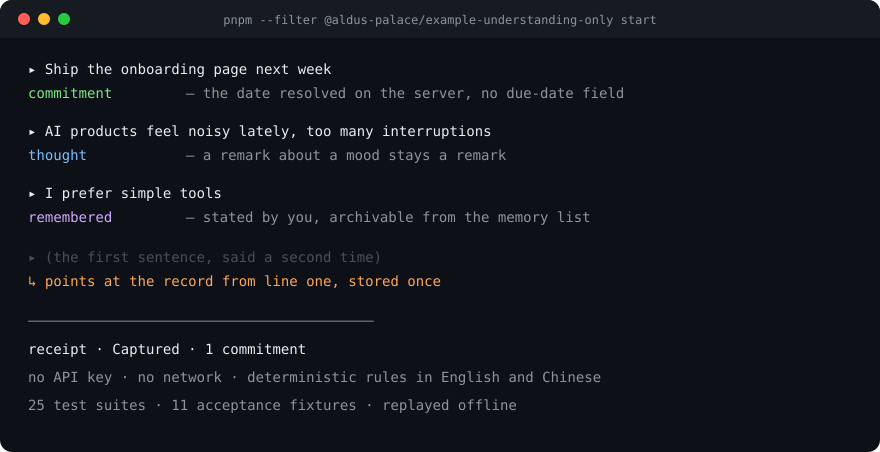

# Aldus Palace

[](https://github.com/heymi/aldus-palace/actions/workflows/ci.yml)
[](https://www.npmjs.com/package/@aldus-palace/core)
[](https://www.npmjs.com/package/@aldus-palace/mcp)
[](https://www.npmjs.com/package/@aldus-palace/client)
[](LICENSE)



**The auditable memory layer for AI apps.** Free text goes in; typed
commitments, decisions and memories come out — each with the evidence behind it,
in a SQLite file you own.

**Evaluate it in five minutes:** [`EVALUATION.md`](EVALUATION.md) maps every
claim to the command that proves it. [中文版 README](README.zh.md) ·
[中文评估指南](EVALUATION.zh.md).

---

A to-do list asks you to file, tag, date and prioritize every item. The list
grows. The managing becomes the work.

An AI assistant remembers things about you. That memory sits in a closed box. You
read it through one app, and you move it nowhere.

Aldus Palace holds one place for what you need to do. You write a sentence. The
system does the filing.

```
$ pnpm demo

$ input  Ship the onboarding page next week
Captured · 1 commitment
  commitment  Ship the onboarding page next week  ·  window 2026-09-19 → 2026-09-26

$ input  I prefer simple tools
Captured · remembered 1
  memory      Prefers simple products and interfaces; avoids complexity  ·  active
```

That output comes from the deterministic provider, offline; dates resolve on the
day you run it. `pnpm demo` runs the same pipeline with no API key.

**Try it in your assistant.** MCP inside Claude, Cursor or any MCP client:

```bash
npm install -g @aldus-palace/mcp
claude mcp add aldus-palace -- node "$(npm root -g)/@aldus-palace/mcp/dist/index.js"
```

## What it does

**It reads a sentence and sorts it.** Write "Ship the onboarding page next week"
and you get one commitment, with the date worked out. No project picker, no
priority field, no due-date calendar. Paste a paragraph and you get several
objects: thoughts, commitments, decisions, memory candidates.

**It catches repeats.** Repeat yourself and the system points at the first record.

**It remembers the rules you state.** "I prefer simple tools" lands as a rule the
system follows from the next capture onward. The memory list archives it.

**It shows its work.** Every memory carries the sentence you said, the
confidence behind it, and a note that says whether you stated it or the system
inferred it.

**It follows you.** One file, one API. Claude, Cursor, your own frontend, a script
you write.

## Who it's for and when

**Who it's for**

| You are | What you actually get | Start at |
|---|---|---|
| A developer building an AI product | A user writes a sentence; the system sorts it into a task, a decision or a preference worth remembering, stores it, and schedules it when needed. You do not design those rules yourself. | [INTEGRATION.md](docs/INTEGRATION.md) |
| An individual who wants their context to be theirs | Your memory and to-dos sit in one file you own; Claude, Cursor and your terminal all read the same one, every memory shows where it came from, and you can delete any of it. | [Capabilities 5, 6, 9](docs/CAPABILITIES.md) |
| A team that must audit AI-written data | Every action the system takes for you is recorded, reviewable and revocable; names and amounts are stripped before anything reaches a model; deleting really deletes. | [SECURITY.md](SECURITY.md) · [ADR 0005](docs/adr/0005-action-gate-with-published-risk.md) |

**What developers get out of the box**

| Capability | What it lets you ship |
|---|---|
| **Text → typed objects** | A user writes a sentence and the product already has the task, the decision and the preference — dates resolved, duplicates skipped, model failures handled. No form, no classification rules of your own. |
| **A memory layer** | An assistant that remembers a person over time, where every memory explains itself, can be corrected and can be undone — no "personality from one remark". |
| **A planning engine** | A "what now" answer instead of a wall of red items: work ordered by dependency, a daily buffer, and slipped work that moves itself. |
| **Local first + background enrichment** | Instant feedback, then the model catches up; retries, concurrency and crashes never lose or duplicate data. |
| **The Action Gate + privacy** | Let the agent act: high-risk steps ask first, autonomy grows as trust is earned, every step is revocable; cloud calls are redacted, users can revoke permissions and truly delete. |
| **Replaceable, offline-testable, four surfaces** | SQLite and an offline model today; Postgres or another model later without touching your code; `pnpm verify` green with no key; library / HTTP / MCP / typed client. |

**When to use it**

| Your situation | What the system does |
|---|---|
| "My memory does not follow me between clients." | One file behind MCP, read by Claude, Cursor and your terminal. |
| "My assistant invented a preference and I cannot delete it." | The gate waits for your confirmation, every memory shows its evidence, and any of them can be archived. |
| "Twelve red items and I freeze." | One scored "now", missed dates as risks instead of failures, and a quarter of the day left free. |
| "We must show how an AI-written record came to be." | Every change writes an action log with a reason; memories keep their evidence and versions. |
| "A risky action needs a human in the loop." | The Action Gate grades every agent action; high risk waits for one approval, critical for two, and the log is revocable. |
| "Sensitive data cannot go to a model as-is." | The Privacy Gateway redacts by data level; level 4 stays local, permissions are scopes, Memory is private by default. |

**When it is the wrong fit:** not a calendar, not a team task manager, not a note
editor, not a hosted service — see [USE-CASES.md](docs/USE-CASES.md#anti-patterns).

## Sentences it understands

A real run of the offline provider. Relative dates resolve at capture time.

| You write | It files |
|---|---|
| Ship the onboarding page next week | commitment · window 2026-09-19 → 2026-09-26 |
| I prefer simple tools | memory · active, because you stated it |
| Keep Mac only, no Windows version | thought + decision + memory waiting for confirmation |
| Fix the notification bug tomorrow, twice | commitment · the repeat points at the first record |
| 下周把 onboarding 做完 | 要做 · 时间窗 2026-09-19 → 2026-09-26 |
| 以后产品不要做太复杂，保持克制 | 记忆 · 已生效，因为你亲口说了 |
| 今晚先不做评审，改排到周五 | 要做 · 截止 2026-09-25 |

## How this compares

| The dimension | What you use today | Aldus Palace |
|---|---|---|
| **What you give it** | a form: project, due date, priority, tags | a sentence in your own words; a paragraph yields several records |
| **Who decides the shape** | you classify, prioritize and schedule | the runtime files the thought, the commitment, the decision and the memory |
| **How time works** | one due date, and a red label when it passes | four kinds held apart — deadline, availability window, suggested slot, unscheduled — and a missed date becomes a risk you can move |
| **How memory behaves** | the assistant infers and stores inside that app | confident memories take effect on capture, and each one carries the sentence it came from plus a note saying why it is active |
| **Where your words live** | summarized into a task or a chat log | kept as you wrote them, with the system's own reading beside them |
| **What the daily view answers** | a list of everything | what to do now, what is at risk, what is unscheduled; a full day gets a rest suggestion |
| **How many stores you have** | one per app | one record, reached by MCP, HTTP, a library and a typed client: Claude, Cursor, your own frontend, a script |
| **Where the record sits** | a vendor cloud | a SQLite file you own, or a Cloudflare Worker; copy it, back it up, hand it on |
| **How you verify it** | by using it | a deterministic provider runs the pipeline with no network and no API key; 26 suites and 11 fixtures replay each run |

## Current scope

- **One user.** One person, one database, one bearer token. Run one instance per
  person.
- **One writer per SQLite file.** Two processes on the same file fight over the
  write lock. Point extra clients at the HTTP API.
- **No client interface.** The surfaces are MCP, HTTP, the library and a typed
  client. You bring the screen.
- **No sync.** The file does not merge with a second copy.
- **No external actions.** The runtime records intent and plans. It sends no mail,
  posts nothing and pays nobody.
- **Offline mode recognises a narrow set of phrasings.** The deterministic
  provider handles commands, stated rules and a few date forms, in English and
  Chinese. Connect a model for general understanding; the receipts show which
  provider produced them.

## Build with it

Four ways in, one schema, open source under Apache-2.0. Offline mode runs with
no API key.

**Library**

```ts
import { DevLLMProvider, ensureDevUser, formatActionCard, initialize, newId,
         nowIso, processRawInput } from "@aldus-palace/core";
import { openSqliteDatabase } from "@aldus-palace/core/db/sqlite";

const db = await openSqliteDatabase("./aldus.db");
await initialize(db);                              // canonical DDL + migrations
const user = await ensureDevUser(db, { name: "Me", timezone: "UTC", language: "en" });

const id = newId("inp");
const text = "Ship the onboarding page next week";
await db.prepare(`INSERT INTO raw_inputs
  (id, user_id, content, source, processing_status, created_at, updated_at)
  VALUES (?, ?, ?, 'text', 'pending', ?, ?)`)
  .run(id, user.id, text, nowIso(), nowIso());

const card = await processRawInput(db, new DevLLMProvider(), user, id, "local");
console.log(formatActionCard(card));
// Captured · 1 commitment
//   commitment  Ship the onboarding page next week  ·  window 2026-09-19 → 2026-09-26
```

**MCP** — inside Claude, Cursor or any MCP client

```bash
npm install -g @aldus-palace/mcp
claude mcp add aldus-palace -- node "$(npm root -g)/@aldus-palace/mcp/dist/index.js"
```

**HTTP** — self-hosted, SQLite in a volume

```bash
cp .env.example .env && docker compose up --build
curl -X POST localhost:8787/v1/inputs \
  -H 'Authorization: Bearer dev-local-token' -H 'Content-Type: application/json' \
  -d '{"content":"Ship the onboarding page next week","mode":"sync"}'
```

**Client** — a typed client over the same HTTP API

```ts
import { createClient } from "@aldus-palace/client";

const aldus = createClient({ baseUrl: "http://localhost:8787", token: "dev-local-token" });
const card = await aldus.capture("Ship the onboarding page next week", "local");
console.log(card.action_card.summary);        // Captured · 1 commitment
console.log(await aldus.actions("proposed")); // what the Action Gate is holding
```

---

## Scale

`packages/core` is runtime-agnostic and dependency-light: `zod`, `dayjs` and
`nanoid`. **Requirements:** Node 20 or newer. `better-sqlite3` ships prebuilds
for common platforms; other platforms need a C toolchain.

## The system behind it

The runtime runs as a pipeline, and the Core Intelligence Layer organises it into
four engines. Understanding — the capture front end in `agent/understand.ts` —
turns a sentence into typed objects; the engines decide what is kept, what
happens next, what the system may do on its own, and which model is used. A model
can contribute to understanding and to conflict detection, and every engine has a
path that runs without one. Each engine ships today and has a designed
extension — the shipped parts name the file they live in, and the full design is
mapped in [`docs/INTELLIGENCE.md`](docs/INTELLIGENCE.md).

```
user / environment
      |
input          raw text, stored as written
      |
understanding  intent, typed objects, resolved dates, gates
      |
memory         candidates, evidence, confirmation, conflicts, versions
      |
planning       four kinds of time, today, risk, adaptive limits
      |
context        active memories and projects feed the next capture
```

| Engine | Shipped today | Designed next |
|---|---|---|
| **Memory** | extraction, a pollution gate, an activation gate, evidence on every row, duplicate collapse, conflict detection, versioned supersede, graded levels with decay and a value score, ranked retrieval into the next capture | more kinds and extraction signals, an identity level, a memory graph |
| **Planning** | four kinds of time, constraint handling (deadline, window, preference, blocked-by dependencies), priority scoring, slot search, duration estimation from project history, a daily buffer, migration for slipped flexible work, a scored Now with context match, a morning core/optional/deferred plan, replanning after a change, Today, risk, adaptive limits, a learned behaviour model | soft-constraint trade-offs, a blended priority score, a rhythm-aware Now, an events surface for meetings |
| **Trust & autonomy** | an Action Gate (low and medium run, high waits, critical needs two), a trust score with levels 0–4, and permission evolution capped by a user ceiling | proactive rules |
| **Model orchestration** | one `LLMProvider` interface and three implementations, configuration resolved by the caller | routing by task — fast classification, reasoning, embeddings, a local model for sensitive input |

The runtime lives in `packages/core/src`: `agent/understand.ts` for capture, `services/` for planning, memory, the Action Gate and privacy, `lib/` for the pure helpers, and `providers/` for the model interface. The capability-by-capability map is in [`docs/MAP.md`](docs/MAP.md), and the full design, with each engine's shipped and planned parts in depth, is in [`docs/INTELLIGENCE.md`](docs/INTELLIGENCE.md).

### The memory pipeline

```
capture -> extraction -> candidate -> evaluation -> conflict check -> storage -> activation -> retrieval
```

- **Extraction** reads two signals: durability markers ("from now on", "as a rule") and repeated behaviour. Rules run with no model; a model adds general understanding.
- **Evaluation** drops what should not be remembered: a temporary state, a one-off creative fragment, a low-confidence guess.
- **Activation** follows one published rule: `confidence >= 0.8` and `importance >= 0.8`. Everything below that waits as a candidate.
- **Conflict check** compares a candidate against active memories on the same dimension and reports the contradiction instead of storing both.
- **Retrieval** injects active memories into the next capture, so understanding improves with use. Each injection lands in the action log.

### Three rules that keep memory honest

1. **A mood does not become a profile entry.** "I'm tired today" is dropped before storage.
2. **One inference does not make a principle.** A principle the system inferred waits for confirmation, whatever its score.
3. **Every memory carries evidence.** The sentence it came from, a confidence value, and a note that says whether you stated it or the system inferred it.

### Privacy is the architecture

*The system touches work, decisions, relationships and habits; privacy is the
shape of it, not a feature on top.*

**Shipped today** — a SQLite file you own (or one Cloudflare Durable Object), a
single-user runtime, immutable `raw_inputs`, model output validated and gated, an
`action_log` entry on every mutation, and a memory gate that confident, stated
memories pass on capture while an inference waits for you. A Privacy Gateway
prepares a cloud call by data level (names, money, emails and phone numbers are
replaced, level 4 stays local), permissions are progressive with Memory private
by default, and `purgeUserData` deletes every row the user owns in one
transaction. [`SECURITY.md`](SECURITY.md) records the posture and the current
threat model.

**Designed next** — local encrypted storage (Keychain / Secure Enclave), and
routing every cloud call through the gateway rather than leaving that to the
caller.

## Where the difficulty lives

**Models return text. Code needs records.** A model writes `"0.8"` where you
asked for a number, invents a date, or stores one task under two titles. The
runtime validates each answer, skips duplicates and resolves dates on the server.
A failed answer leaves the previous record in place.

**The slow path breaks products.** A user waits on a model and loses interest. A
background model meets retries, two clients writing at once, and records stuck
mid-update after a crash.

**Memory is a liability.** Store the first inference and the user owns a
personality from one remark. Replace the old record and the history disappears.

## What the code enforces

| Capability | The point | Where |
|---|---|---|
| Schema & domain | `overdue` has no state to occupy; a deadline, a window and a slot are three fields | `db/schema.ts` |
| Providers | a deterministic provider shares the interface with the paid ones, so agent logic runs in CI | `providers/dev.ts` |
| Understanding | the model proposes; the server decides (mode, duplicates, dates, fallback) | `agent/understand.ts` |
| Progressive capture | a lease and a generation id make "local first, model second" idempotent | `services/enrichmentLease.ts` |
| Memory | a confident memory takes effect, explains itself, and versions instead of deleting | `lib/memoryActivation.ts`, `services/memoryEvolution.ts` |
| Today & planning | a day with no plan gets suggestions; a full day gets a rest suggestion; a quarter of the day stays free, slipped flexible work moves forward, a blocked commitment is never scheduled, and Now is scored rather than first-in-line | `services/today.ts`, `services/workMigration.ts`, `services/dependencies.ts`, `lib/nowScore.ts` |
| Work streams | grouping is a rebuildable projection; the records stay as they are | `services/workStreams.ts` |
| HTTP API | one schema, two runtimes: a local SQLite file and a Cloudflare Durable Object | `apps/server` |
| MCP server | runs with no server process, against the same local file | `packages/mcp` |
| Action Gate | an unclassified agent action waits; a critical one needs two approvals; every decision is logged and revocable, and trust is the approval rate of those decisions | `services/actionGate.ts` |
| Privacy | a cloud call is redacted by data level and level 4 stays local; Memory is private until a scope is granted; deletion empties every table for the user | `services/privacyGateway.ts`, `services/permissions.ts`, `services/dataLifecycle.ts` |

The pipeline runs offline: a deterministic provider implements the same interface
as the model-backed ones, so 26 test suites and 11 acceptance fixtures replay
with no key.

## See it run

```bash
git clone https://github.com/heymi/aldus-palace.git && cd aldus-palace
pnpm install

pnpm test     # 26 suites — deterministic, offline, no API key
pnpm eval     # 11 acceptance fixtures — the behaviour this project promises

pnpm --filter @aldus-palace/example-understanding-only start
pnpm --filter @aldus-palace/example-memory-gate-only start
pnpm --filter @aldus-palace/example-today-only start
```

Each example prints the records it stored and the reasoning behind them, with no
API key and no network.

## Install

| Surface | Command |
|---|---|
| MCP | `npm install -g @aldus-palace/mcp` |
| HTTP | `cp .env.example .env && docker compose up --build` |
| Library | `npm install @aldus-palace/core` |
| Client | `npm install @aldus-palace/client` |

## Documentation

| Doc | Contents |
|---|---|
| [INTEGRATION.md](docs/INTEGRATION.md) | the three levels, with copy-paste configs |
| [CAPABILITIES.md](docs/CAPABILITIES.md) | the nine capabilities and their contracts |
| [USE-CASES.md](docs/USE-CASES.md) | five things people build with this |
| [POSITIONING.md](docs/POSITIONING.md) | differentiation, and the current scope |
| [ARCHITECTURE.md](docs/ARCHITECTURE.md) | the runtime, module boundaries, storage port |
| [INTELLIGENCE.md](docs/INTELLIGENCE.md) | the four engines and the privacy design, shipped vs planned |
| [BENCHMARKS.md](docs/BENCHMARKS.md) | measured rule-layer accuracy, with the command to reproduce it |
| [MAP.md](docs/MAP.md) | capability → code → doc → test |
| [GLOSSARY.md](docs/GLOSSARY.md) | the shared vocabulary |
| [EVALUATION.md](EVALUATION.md) | every claim mapped to its proof, and what is not built |
| [DOMAIN-SCHEMA.md](docs/DOMAIN-SCHEMA.md) | objects, invariants, memory evolution |
| [DEPLOYMENT.md](docs/DEPLOYMENT.md) | local, edge, embedded, backups |
| [EVAL.md](docs/EVAL.md) | the acceptance fixtures, and how to add one |
| [PROGRESSIVE-CAPTURE.md](docs/PROGRESSIVE-CAPTURE.md) | the enrichment lease, written to be copied |
| [packages/client/README.md](packages/client/README.md) | the typed HTTP client |
| [adr/](docs/adr) | decisions already made, and why |

## Repository layout

```
packages/core          domain, agent runtime, storage port, migrations, providers
packages/mcp           MCP server (stdio) — profiles, local and HTTP backends
packages/client        typed HTTP client, one method per route
apps/server            Hono reference server (local SQLite and Cloudflare Durable Object)
examples/              five runnable examples, one per capability group
spec/schema.sql        generated, readable schema (CI-checked)
eval/fixtures          acceptance scenarios
docs/                  everything above
```

## Status

`0.x` — usable and tested; the API may change between minor versions. See
[SECURITY.md](SECURITY.md) before exposing an instance.

## Contributing

Fixtures, docs and focused fixes are welcome. See [CONTRIBUTING.md](CONTRIBUTING.md).
Commits carry a DCO sign-off (`git commit -s`).

## License

[Apache-2.0](LICENSE).
